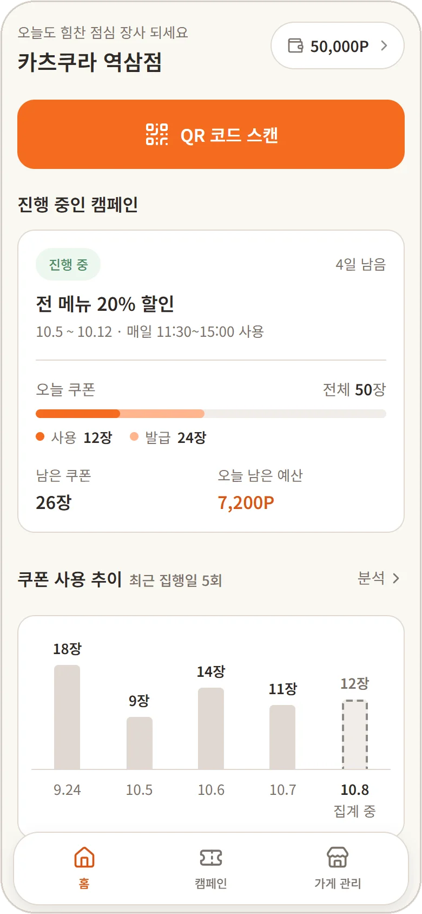
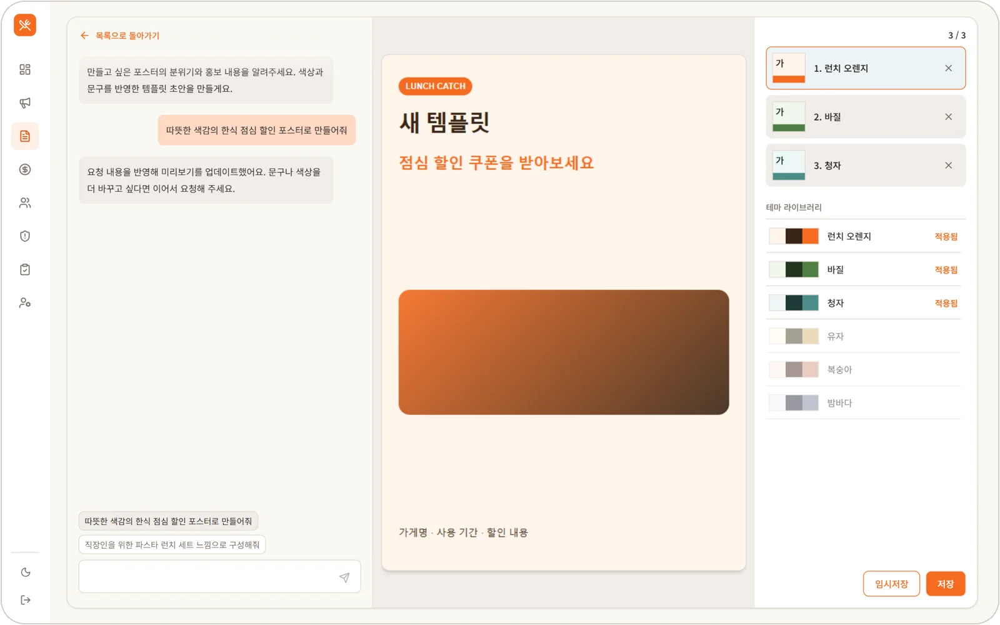
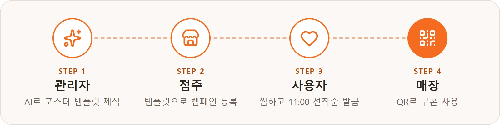
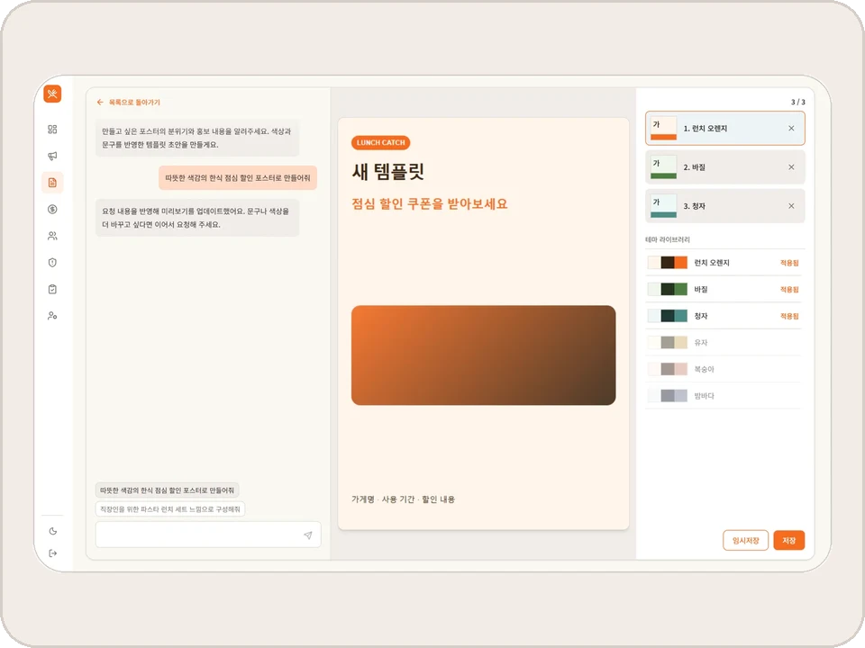
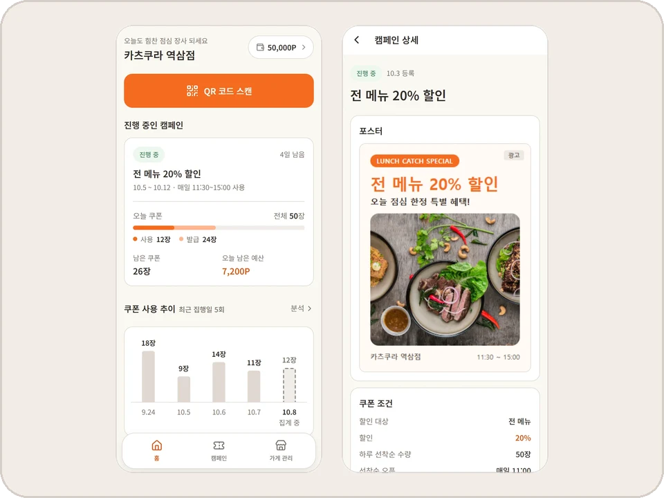
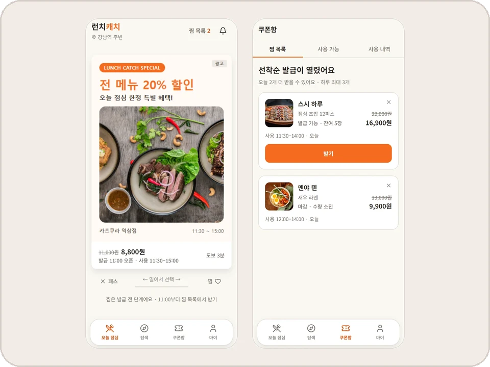
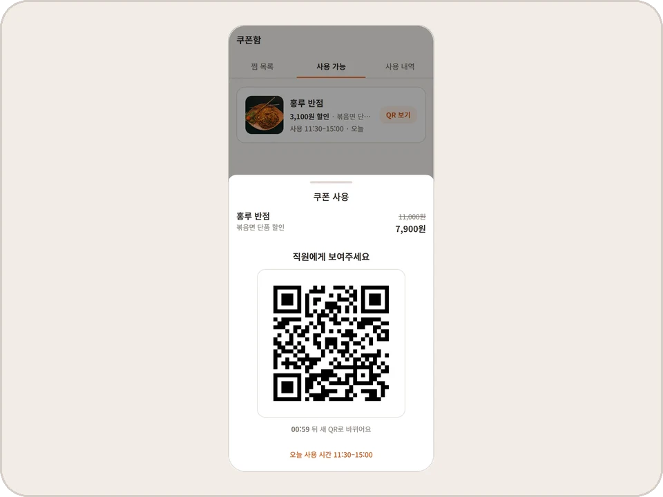

# 🍱 런치캐치 (Lunch Catch)

> 주변 가게와 직장인을 점심 쿠폰으로 이어주는 위치 기반 쿠폰 플랫폼

<p align="center">
  
  
  
  <br />
  <sub>왼쪽부터 사용자 앱 · 점주 앱 · 관리자 앱</sub>
</p>

<br>

## 목차

- [프로젝트 소개](#프로젝트-소개)
- [팀원 소개](#팀원-소개)
- [핵심 기능](#핵심-기능)
- [앱 둘러보기](#앱-둘러보기)
- [기술 스택](#기술-스택)
- [시스템 구조](#시스템-구조)
- [포팅 매뉴얼](#포팅-매뉴얼)
- [폴더 구조](#폴더-구조)
- [협업 규칙](#협업-규칙)

<br>

## 프로젝트 소개

### 개발 기간

2026.09.09 ~ 2026.10.28 (7주)

### 기획 배경

- **문제**: 직장인은 매일 점심 메뉴를 고민하는데 외식비는 계속 오르고, 동네 가게 사장님은 점심 손님을 더 모으고 싶어도 적은 비용으로 할 수 있는 홍보 수단이 부족
- **정의**: 직장인과 주변 가게 사이에 서로의 필요를 이어주는 채널 부재
- **해결**: 사장님은 LLM으로 만든 템플릿에 가게 정보만 채워 쿠폰 포스터를 등록하고, 주변 직장인은 점심 할인을 받는 위치 기반 쿠폰 플랫폼

<details>
<summary><b>📋 과제 요구사항 구현 내용</b></summary>

<br>

- 과제 **AI 기반 이벤트 페이지 제작 및 게시 관리 시스템**의 이벤트 페이지를 **점심 쿠폰 포스터**로 해석
- 관리자가 LLM으로 만든 포스터 템플릿을 점주가 가져다 쿠폰 광고를 만들고, 사용자는 그 포스터를 보고 쿠폰 발급

| 과제 요구사항 | 구현 내용 |
| --- | --- |
| 채팅으로 이벤트 페이지 HTML 생성·수정 | 관리자가 "가을 신메뉴 느낌으로 만들어줘"처럼 요청해 포스터 템플릿 HTML을 생성하고, "버튼 색상을 바꿔줘"처럼 수정 |
| iframe 미리보기 | 관리자 템플릿, 점주 포스터, 사용자 피드와 가게 상세의 포스터를 모두 iframe으로 표시 |
| 저장과 수정 이력 | 미리보기를 확인하고 임시저장할 때마다 새 버전으로 저장 |
| 게시 상태 관리 | 템플릿은 임시저장 → 게시 → 활성/비활성, 캠페인은 활성화 → 중단·재개 → 종료 |
| 이벤트 기간과 노출 제어 | 캠페인 집행 기간과 하루 예산, 서빙 시간대(10:00~12:59) |
| 사용자 화면에서 조회 | 점주가 만든 포스터가 사용자 피드와 가게 상세에 그대로 노출 |

</details>

<br>

## 팀원 소개

### Frontend

| 이규태 | 고유정 | 서지현 |
| :---: | :---: | :---: |
|  |  |  |
| [@Ourumo](https://github.com/Ourumo) | [@daenggg](https://github.com/daenggg) | [@jhwest-dev](https://github.com/jhwest-dev) |
| FE 파트장 · 점주 앱 | 관리자 앱 | 사용자 앱 |

### Backend

| 박준서 | 김현우 | 정규동 | 최민혁 | 최재웅 |
| :---: | :---: | :---: | :---: | :---: |
|  |  |  |  |  |
| [@devjohnpark](https://github.com/devjohnpark) | [@muzimzz](https://github.com/muzimzz) | [@gyudongjeong](https://github.com/gyudongjeong) | [@MinhyeokChoi99](https://github.com/MinhyeokChoi99) | [@yongmaru789](https://github.com/yongmaru789) |
| 팀장 · 광고 서빙 · 인프라 | 회원 · 정산 · 분석 | 계정 · 입점 · 알림 | 쿠폰 · 가게 탐색 | 캠페인 · 템플릿 · 운영 |

백엔드 저장소: [lunch-catch/lc-backend](https://github.com/lunch-catch/lc-backend) · 인프라 저장소: [lunch-catch/lc-infra](https://github.com/lunch-catch/lc-infra)

<br>

## 핵심 기능



| 화면 | 기능 |
| :---: | --- |
|  | **1. 관리자 · AI로 포스터 템플릿 제작**<br><br>• 채팅으로 요청하면 LLM이 포스터 템플릿 HTML을 생성하고, 결과를 iframe으로 바로 미리보기<br>• 마음에 드는 결과는 임시저장해 버전으로 쌓고, 그중 하나를 게시해 점주에게 공개 |
|  | **2. 점주 · 캠페인과 포스터 등록**<br><br>• 공개된 템플릿을 골라 가게 사진, 할인 문구 같은 빈칸만 채워 포스터 제작<br>• 쿠폰 조건, 노출 대상, 하루 예산과 기간을 정하고, 자동 검수를 통과하면 캠페인 노출 |
|  | **3. 사용자 · 찜하고 11:00 선착순 발급**<br><br>• 10:00부터 주변 가게 포스터를 카드로 넘기며 마음에 드는 쿠폰 찜<br>• 10:50에 오픈 알림을 받고, 11:00에 찜한 쿠폰을 선착순으로 발급 |
|  | **4. 매장 · QR로 쿠폰 사용**<br><br>• 사용자가 60초 동안만 유효한 1회용 QR을 보여주면 점주가 스캔해 사용 처리<br>• QR은 60초마다 새로 바뀌고 한 번 쓰면 다시 쓸 수 없어, 캡처한 QR로 돌려쓰기 방지 |

<br>

## 앱 둘러보기

| 앱 | 대상 | 주소 | 문서 |
| --- | --- | --- | --- |
| 관리자 앱 | 운영자 | https://admin.lunchcatch.com | [README](apps/admin/README.md) |
| 점주 앱 | 가게 사장님 | https://owner.lunchcatch.com | [README](apps/owner/README.md) |
| 사용자 앱 | 직장인 (모바일 웹) | https://lunchcatch.com | [README](apps/user/README.md) |

<br>

## 기술 스택

| 구분 | 기술 |
| --- | --- |
| Frontend | React 19, TypeScript, Vite 8, React Router, Tailwind CSS v4 |
| Monorepo | pnpm workspaces, Turborepo |
| UI · 문서 | Storybook 10, Vitest (`@repo/ui` 공통 컴포넌트) |
| 코드 품질 | ESLint, Prettier, Husky, lint-staged |
| 인증 · 알림 | Kakao Login (OAuth), Firebase Cloud Messaging |
| Backend | Java 21, Spring Boot 4, MySQL 8.4, Valkey 9 ([lc-backend](https://github.com/lunch-catch/lc-backend) 참고) |
| AI | LLM (AWS Bedrock 예정, 백엔드에서 호출) |
| 배포 | Vercel (프론트 앱별 프로젝트), AWS · Terraform (백엔드, [lc-infra](https://github.com/lunch-catch/lc-infra) 참고) |
| 협업 | GitHub (Issues, Projects), Figma, Notion |

<br>

## 시스템 구조

<!-- TODO: 시스템 구조 이미지 -->

### LLM이 만든 HTML 격리

- 관리자 템플릿 미리보기, 점주 포스터 미리보기, 사용자 피드와 가게 상세의 포스터를 모두 `sandbox` iframe 안에서만 표시
- 스크립트 실행, 폼 제출, 외부 이동을 막아 생성된 HTML이 앱에 영향을 주지 않음

### 앱별 배포

- 세 앱은 한 저장소에서 개발하고, Vercel 프로젝트를 나눠 각각 빌드와 배포
- 여러 앱이 함께 쓰는 컴포넌트, 디자인 토큰, 설정은 `packages`에서 공유

| 구분 | 운영 (`main`) | 개발 (`develop`) |
| --- | --- | --- |
| 사용자 | https://lunchcatch.com | https://dev.lunchcatch.com |
| 점주 | https://owner.lunchcatch.com | https://owner.dev.lunchcatch.com |
| 관리자 | https://admin.lunchcatch.com | https://admin.dev.lunchcatch.com |
| API 서버 (세 앱 공통) | https://api.lunchcatch.com | https://api.dev.lunchcatch.com |

### HttpOnly 쿠키 인증

<!-- TODO: 점주 앱 API 클라이언트를 만든 뒤 함께 적용됐는지 확인 -->

- 서버가 발급한 HttpOnly 쿠키를 브라우저가 요청마다 자동으로 전송하고, 프론트는 토큰을 직접 저장하거나 읽지 않음
- API 요청에는 `credentials: 'include'`만 설정

<br>

## 포팅 매뉴얼

### 1. 요구 사항

- Node.js: Vite 8 기준 `20.19` 이상 또는 `22.12` 이상
- pnpm: 루트 `package.json`의 `packageManager` 버전을 corepack이 자동으로 사용
- API 서버: [lc-backend](https://github.com/lunch-catch/lc-backend)를 로컬(`http://localhost:8080`)에서 실행하거나 개발 서버 주소 사용

### 2. 저장소 클론과 의존성 설치

```bash
git clone https://github.com/lunch-catch/lc-frontend.git
cd lc-frontend

# Node 25 이상이라면 먼저 실행
npm install -g corepack

corepack enable pnpm
pnpm install
```

- `pnpm install`이 끝나면 Husky가 커밋 전 검사(ESLint, Prettier)를 자동 설정

### 3. 환경 변수

| 이름 | 사용하는 곳 | 설명 |
| --- | --- | --- |
| `VITE_API_BASE_URL` | 배포 | API 서버 주소 (빌드할 때 코드에 들어가 Vercel에 설정) |
| `API_PROXY_TARGET` | 로컬 개발 | `/v1` 요청을 넘길 API 서버. 기본값 `http://localhost:8080` |

- 로컬에서는 환경 변수 파일 없이 실행 가능
- `VITE_API_BASE_URL`을 비워 두면 Vite 개발 서버가 `/v1` 요청을 `API_PROXY_TARGET`으로 넘겨, CORS 설정 없이 쿠키까지 주고받음
- 로컬 백엔드 대신 개발 서버에 붙이려면 앱 폴더에 `.env.local` 생성 (git에 올라가지 않음)

```bash
# apps/user/.env.local
API_PROXY_TARGET=https://api.dev.lunchcatch.com
```

### 4. 로컬 실행

| 명령어 | 설명 | 주소 |
| --- | --- | --- |
| `pnpm dev` | 세 앱을 함께 실행 | |
| `pnpm dev:user` | 사용자 앱 | http://localhost:5173 |
| `pnpm dev:owner` | 점주 앱 | http://localhost:5174 |
| `pnpm dev:admin` | 관리자 앱 | http://localhost:5175 |
| `pnpm storybook` | 공통 컴포넌트 Storybook | http://localhost:6006 |

- 포트가 이미 사용 중이면 다른 포트로 넘어가지 않고 실행 중단

### 5. 빌드와 검사

| 명령어 | 설명 |
| --- | --- |
| `pnpm build` | 세 앱 빌드 (타입 검사 포함) |
| `pnpm exec turbo run build --filter=user` | 한 앱만 빌드 |
| `pnpm lint` | ESLint 검사 |
| `pnpm typecheck` | 타입 검사 |
| `pnpm format:check` | Prettier 검사 |

### 6. 배포

- Vercel 설정과 운영 시 알아 둘 점: [docs/deployment.md](docs/deployment.md)

<br>

## 폴더 구조

```
lc-frontend/
├── apps/
│   ├── user/              # 사용자(직장인) 앱
│   ├── owner/             # 점주 앱
│   ├── admin/             # 관리자 앱
│   └── storybook/         # 공통 컴포넌트 문서·테스트
├── packages/
│   ├── ui/                # @repo/ui: 공통 컴포넌트, 디자인 토큰, 전역 스타일
│   ├── utils/             # @repo/utils: React와 DOM에 의존하지 않는 순수 함수
│   ├── tsconfig/          # 공통 TypeScript 설정
│   └── eslint-config/     # 공통 ESLint 설정
└── docs/                  # 요구사항 명세, 폴더 구조, 컨벤션
```

- 각 앱 내부 구조: 앱별 README의 폴더 구조
- 자세한 규칙: [docs/folder-structure.md](docs/folder-structure.md)

<br>

## 협업 규칙

- 작업은 [GitHub Projects · Frontend](https://github.com/orgs/lunch-catch/projects/15)에서 이슈 단위로 관리
- 브랜치는 `main`(배포), `develop`(개발 통합), `feat/*`(기능 개발)로 구분
- 커밋 메시지는 `feat`, `fix`, `docs`, `chore` 같은 타입 뒤에 한국어 설명
- 커밋 전에 Husky와 lint-staged가 ESLint와 Prettier 자동 실행

- 자세한 규칙: [docs/conventions.md](docs/conventions.md)
