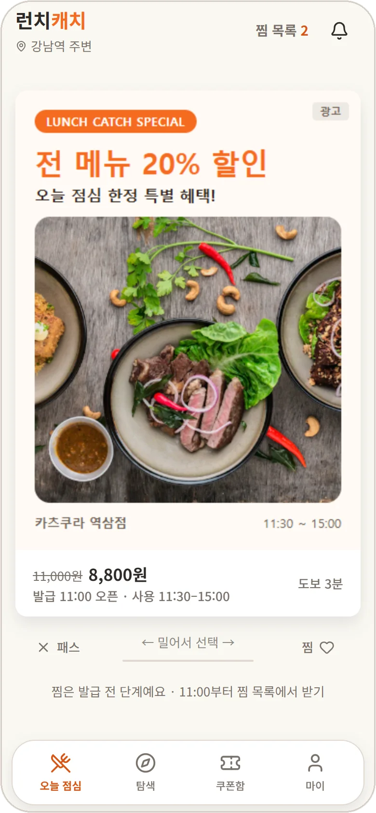
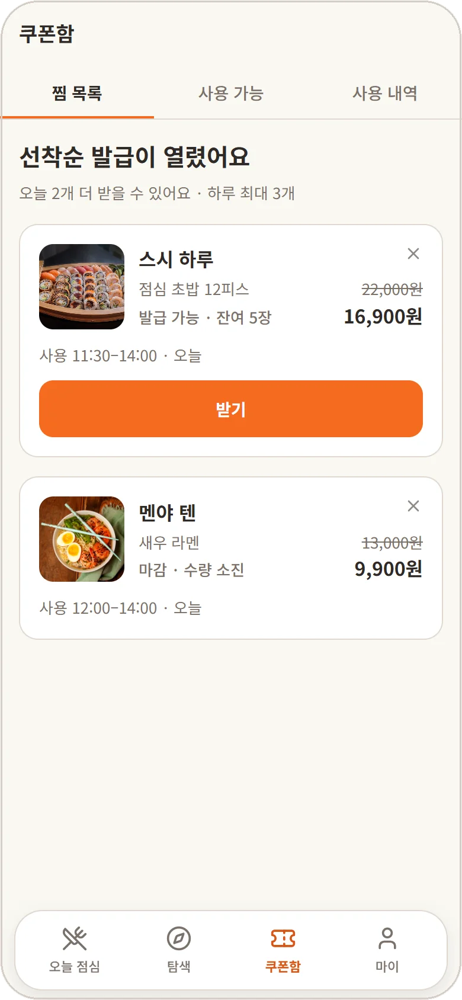
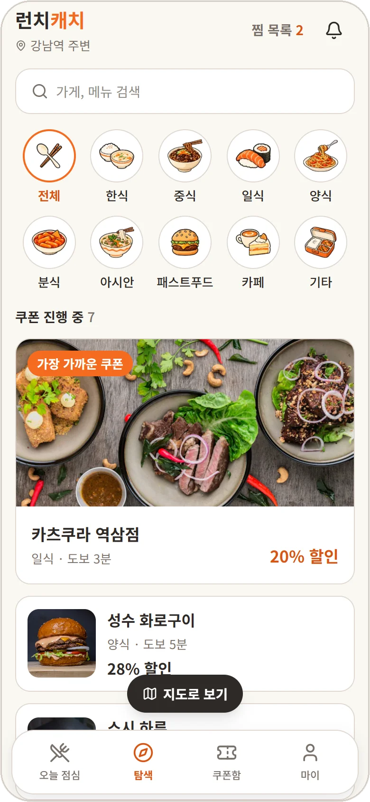
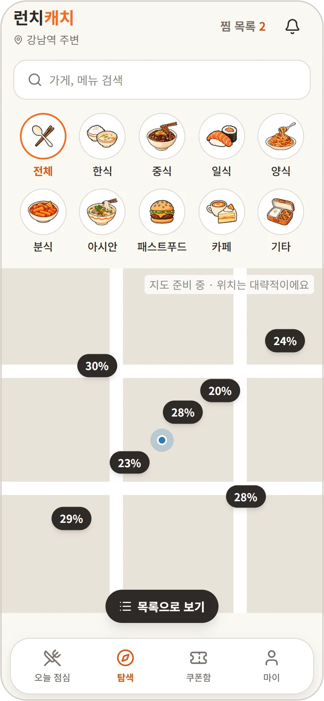
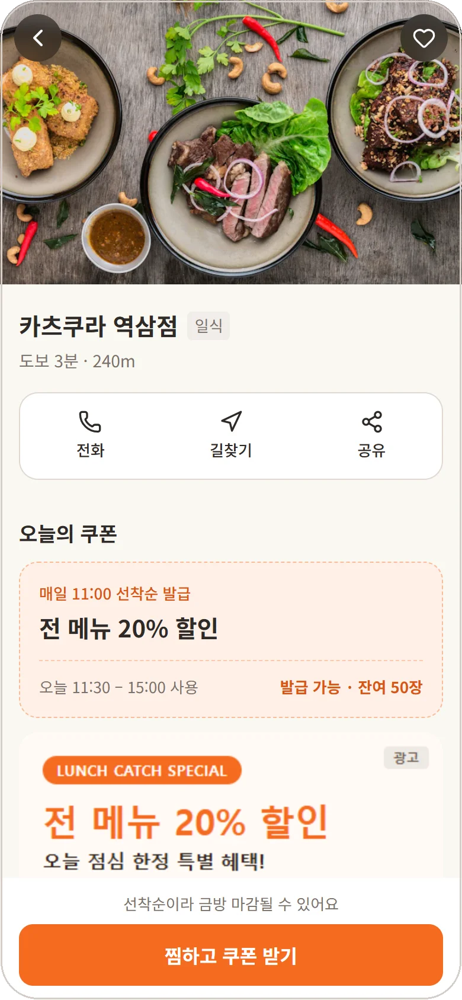

# 🍱 런치캐치 · 사용자 앱

> 직장인이 회사 근처 가게의 점심 쿠폰을 넘겨 보며 찜하고, 11:00 선착순으로 받아 매장에서 사용하는 모바일 웹

[← 프로젝트 README로 돌아가기](../../README.md)

| 오늘 점심 | 찜 목록 | 쿠폰 QR |
| :---: | :---: | :---: |
|  |  |  |
| **탐색** | **지도 보기** | **가게 상세** |
|  |  |  |

<br>

## 주요 화면

| 화면 | 주소 | 설명 |
| --- | --- | --- |
| 로그인 · 온보딩 | `/login`, `/onboarding` | 카카오 로그인, 약관 동의, 관심 업종 설정, 서비스 안내 튜토리얼 |
| 오늘 점심 | `/swipe` | 서빙 시간대(10:00~12:59)에 주변 가게의 쿠폰 포스터를 카드로 넘기며 찜 또는 패스 |
| 찜 목록 | `/coupons/wishlist` | 11:00 오픈 카운트다운, 오픈 뒤 찜한 쿠폰 바로 발급, 하루 발급 한도와 수량 소진 안내 |
| 쿠폰함 | `/coupons`, `/coupons/history` | 받은 쿠폰의 60초 1회용 QR 표시, 사용 내역 확인 |
| 탐색 | `/explore` | 업종 필터, 가게명·메뉴 검색, 목록·지도 전환 |
| 가게 상세 | `/stores/:storeId` | 메뉴, 영업 정보, 위치, 오늘의 쿠폰과 포스터 표시, 바로 찜과 쿠폰 발급 |

<br>

## 구현하며 고민한 것

<!-- TODO: 트러블슈팅과 함께 내용 채우기 -->

- **11:00 정각 맞추기**: 휴대폰 시계가 아닌 서버 시각을 기준으로 카운트다운하고, 오픈 순간 새로고침 없이 받기 버튼으로 전환
- **점주 포스터 격리**: 점주가 만든 포스터 HTML을 `sandbox` iframe 안에서만 그려 스크립트와 외부 이동 차단
- **API 연결 전 화면 개발**: mock 데이터와 주소 옵션으로 선착순 오픈 전후, 마감, 하루 한도 같은 상태별 화면 확인

<br>

## 실행

- 루트 폴더에서 실행
- 설치와 환경 변수: [포팅 매뉴얼](../../README.md#포팅-매뉴얼)

```bash
pnpm dev:user   # http://localhost:5173
```

### mock 상태 확인

- API 연결 전에는 mock 데이터로 동작
- 주소 뒤에 아래 옵션을 붙이면 상태별 화면을 바로 확인 가능

| 옵션 | 확인할 수 있는 상태 |
| --- | --- |
| `?mockTime=10:59:50` | 그 시각부터 시계가 흐름 (11:00 오픈 전후 확인) |
| `?mockFeedClosed` | 서빙 시간대가 아닐 때의 오늘 점심 화면 |
| `?mockWishlistEmpty` | 빈 찜 목록 |
| `?mockDailyLimit` | 하루 발급 한도에 닿은 상태 |
| `?mockIssueSoldOut` | 받는 사이 수량이 소진된 경우 |
| `?mockCouponsEmpty` | 받은 쿠폰이 없는 쿠폰함 |
| `?mockStoresEmpty` | 주변에 가게가 없는 탐색 화면 |

<br>

## 폴더 구조

```
src/
├── app/            # 라우터
├── pages/          # 주소 하나에 대응하는 화면
├── features/
│   ├── login/          # 카카오 로그인
│   ├── onboarding/     # 약관 동의, 관심 업종 설정
│   ├── tutorial/       # 서비스 안내
│   ├── swipe/          # 오늘 점심 스와이프 피드
│   ├── wishlist/       # 찜 목록, 11:00 오픈 카운트다운
│   ├── coupon/         # 쿠폰함, QR
│   ├── explore/        # 탐색 목록, 지도
│   └── store-detail/   # 가게 상세
├── components/     # 여러 기능이 함께 쓰는 컴포넌트
├── layout/         # 하단 탭바, 상단 바 틀
├── api/            # 서버 요청 함수와 mock 데이터
└── auth/           # 로그인 상태와 접근 제어
```
